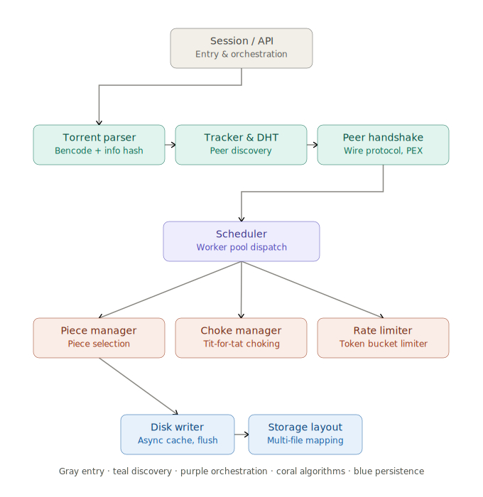

# SiddTorrent — Architecture & Mathematical Reference

*A senior-engineer-oriented walkthrough of the system design and the formal models behind each subsystem.*

---

## 1. System overview

SiddTorrent is a Go BitTorrent client/engine built incrementally across nine phases (see `PhaseWise_Reports/`). It implements the full swarm lifecycle: metainfo parsing → peer/DHT discovery → wire-protocol handshakes → concurrent piece scheduling (rarest-first with a streaming override) → tit-for-tat choking → rate-limited transfer → async batched disk I/O → resumable, multi-file storage. A thin HTTP API (`internal/api`) and session orchestrator (`internal/session`) wrap the engine for a web console and CLI.




The rendered diagram above shows the five functional layers:

| Layer | Packages | Responsibility |
|---|---|---|
| Entry | `internal/session`, `internal/api`, `cmd/*` | Orchestrates a download job, exposes HTTP/CLI, publishes status |
| Discovery | `internal/torrent`, `internal/tracker`, `internal/dht` | Parses `.torrent`, resolves peers via HTTP/UDP trackers and Kademlia DHT |
| Wire protocol | `internal/peer` | Handshake, encryption (RC4 obfuscation), bitfield/have, PEX, message framing |
| Orchestration | `internal/piece/scheduler.go`, `worker.go` | Worker pool per peer, PEX dialer, choke ticker, metrics ticker |
| Core algorithms | `internal/piece` (manager, rarest, choke_manager), `internal/util` | Piece selection, choking policy, rate limiting |
| Persistence | `internal/disk`, `internal/storage` | Async write cache, sequential flush, multi-file offset mapping |

---

## 2. Package map (file → responsibility)

```
internal/torrent    bencode-based .torrent parsing, info_hash = SHA1(raw info dict)
internal/bencode     binary-safe bencode encode/decode with raw byte offset tracking
internal/tracker     HTTP + UDP (BEP 15) tracker announce, IPv4/IPv6 compact peer parsing
internal/dht         Kademlia routing table, UDP RPC (ping/find_node/get_peers)
internal/peer        handshake, RC4 stream obfuscation, message framing, PEX (BEP 11)
internal/piece       PieceManager (availability, rarest-first, streaming), ChokeManager,
                      PieceAssembler (block reassembly), scheduler/worker loops
internal/util        token-bucket RateLimiter, SHA1 VerifyPiece
internal/disk        DiskWriter: in-memory cache + sorted sequential flush
internal/storage     TorrentStorage: byte-range → physical file mapping for multi-file torrents
internal/session     Download(): wires discovery → scheduling → disk → status callbacks
internal/api         HTTP job runner + video streaming reader (StreamingReader)
internal/config      global tunables (retries, window size, cache size, connections)
internal/metrics     atomic counters + periodic throughput report
```

---

## 3. Core algorithms — formal models

### 3.1 Rarest-first piece selection (`piece/manager.go`, `piece/rarest.go`)

Each piece *i* has an **availability count** `A[i]`, maintained incrementally as peers connect/disconnect (`RegisterPeerBitfield` / `UnregisterPeerBitfield`), rather than recomputed from scratch:

```
A[i] += 1   when a peer's bitfield reports piece i        (O(1) amortized)
A[i] -= 1   when that peer disconnects
```

Selection is:

```
i* = argmin_{ i ∈ Pending, available[i] = true } A[i]
```

with uniform-random tie-breaking among the argmin set, to avoid every worker converging on the same piece.

**Bucket optimization.** A naive implementation sorts all pending pieces by count every call — `O(P log P)`. SiddTorrent instead maintains `buckets: map[count] → set[pieceIndex]`. Selection becomes:

```
for c in sorted(bucket keys):        # small, bounded by max peer count
    candidates = { i ∈ buckets[c] : available[i] }
    if candidates ≠ ∅: return uniform_random(candidates)
```

`moveBucket(i, old, new)` keeps buckets consistent in `O(1)` on every availability change. `ensureBucketsSync()` is a defensive full-rebuild guard (`O(P)`) used when tests mutate `Availability`/`Pending` directly, verified by a checksum `Σ A[i]` against `availabilitySum`.

### 3.2 Hybrid streaming selector (`NextStreamingPiece`, Phase 7)

A piecewise policy layered on top of rarest-first:

```
NextPiece(available) =
    { i ,                         if ∃ i ∈ [0, W) : Pending[i] ∧ available[i]   (smallest such i)
    { RarestFirst(available),     otherwise
```

where `W` = `StreamingWindowSize` (default 15). This guarantees monotonically-increasing sequential delivery inside the playback window `[0, W)` — required for progressive media playback — while falling back to the swarm-healthy rarest-first policy for `[W, TotalPieces)`. A dynamic **priority override** (`PriorityPieces`, driven by `StreamingReader.Read`) additionally jumps the selector to whatever byte range the video player is currently seeking, even reclaiming an in-progress piece if necessary — this is why `NextPiece` checks `PriorityPieces` *before* delegating to either sub-policy.

Trade-off made explicit in `Phase7.md`: pure sequential download starves rare pieces swarm-wide; pure rarest-first delays playback indefinitely. The window `W` is the tunable balancing these two failure modes.

### 3.3 Token-bucket rate limiter (`util/rate_limiter.go`, Phase 3)

Classic token bucket with rate `r` (bytes/sec) and capacity `C = r`:

```
tokens(t) = min( C, tokens(t - Δ) + r · (Δ / 1s) )     refilled every Δ = 100ms tick:
                                                          tokens += r/10, capped at C
Wait(n):  block (condition variable) while tokens < n
          tokens -= n
```

**Deadlock fix (Phase 3 problem #2):** if a caller requests `n > C` (e.g. a 16 KiB block against a rate cap set below 16 KB/s), tokens could never accumulate enough under a fixed cap, so `Wait` blocked forever. The fix dynamically grows capacity:

```
C ← max(C, n)   on every Wait(n) call
```

This guarantees liveness at the cost of allowing transient bursts up to the largest single request size — an intentional, documented trade-off.

Asymptotic throughput converges to `r` bytes/sec since token production is rate-bounded regardless of burst size.

### 3.4 EWMA throughput estimation (`peer/state.go`, `piece/choke_manager.go`)

Each peer's instantaneous speed is smoothed with an exponentially-weighted moving average, recomputed every choke-manager tick (10s):

```
instant = IntervalBytes / Δt
DownloadRate ← α · DownloadRate + (1 − α) · instant,     α = 0.8
```

This is a first-order IIR low-pass filter; its effective averaging window (time constant) is `Δt · α/(1−α) = 4·Δt`, i.e. roughly the last ~40 seconds of activity, damping short bursts and network noise before they influence choking decisions.

### 3.5 Peer scoring function (`peer/state.go: CalculateScore`)

A weighted linear combination of four normalized signals, used to rank peers for the tit-for-tat unchoke slots:

```
successRate   = SuccessfulDownloads / TotalDownloads                      ∈ [0,1]
latencyScore  = clamp( 1 − avgLatency / 5s , 0, 1 )                       avgLatency = LatencySum / LatencyCount
speedScore    = clamp( DownloadRate / 1 MiB/s , 0, 1 )
corruptScore  = 1 − CorruptCount / 2

score = 0.4·successRate + 0.4·speedScore + 0.1·latencyScore + 0.1·corruptScore
```

Weights (0.4, 0.4, 0.1, 0.1) encode a design choice: reliability and throughput dominate the ranking, latency and corruption history are tie-breaking modifiers. `corruptScore` reaching 0 at `CorruptCount = 2` deliberately aligns with the blacklist threshold (§3.7) — a peer about to be banned is already scored near zero before the ban fires.

### 3.6 Choking policy — tit-for-tat + optimistic unchoke (`choke_manager.go`)

Run every 10 seconds against all interested peers:

```
ranked = sort_desc(interested_peers, key = CalculateScore)
unchoke_TFT   = top (K − 1) of ranked                      K = MaxUploads (4 in default scheduler config)
unchoke_opt   = 1 peer, uniformly re-sampled from the remainder
                every 3 ticks (⇒ 30s optimistic-unchoke rotation, per BitTorrent convention)
unchoke_set   = unchoke_TFT ∪ { unchoke_opt }
```

Choke/unchoke messages are only sent on a *state transition* (`ChokedByUs` flips), not every tick, to avoid redundant wire traffic. This is a direct implementation of the reciprocity mechanism from the original BitTorrent paper: peers who reciprocate bandwidth get reciprocated; the optimistic slot bounds the discovery time for new fast peers to `O(remaining/1)` expected rotations.

### 3.7 Corrupt-peer detection and blacklisting (`worker.go`, `manager.go`, Phase 9)

```
CorruptCount(peer) += 1   on each SHA1 verification failure of a piece from that peer
if CorruptCount(peer) ≥ 2:  BlacklistPeer(host(peer))
```

Blacklisting is **host-based**, not port-based: `net.SplitHostPort` strips the port before insertion into `BlacklistedPeers[host] = true`, so re-dialing the same IP on a different port (e.g. via PEX/DHT re-discovery) is still rejected by `IsBlacklisted`. This closes the re-dial loophole described in `Phase9.md` problem #3.

### 3.8 Kademlia XOR routing (`dht/kademlia.go`)

Distance metric over 160-bit node IDs:

```
d(a, b) = a ⊕ b                         (bitwise XOR, 20 bytes)
bucket_index(a, b) = 159 − ⌊log2 d(a,b)⌋   (position of the highest set bit)
```

`BucketIndex` scans bytes MSB→LSB and finds the first set bit; nodes sharing a longer common ID prefix land in a higher bucket index (closer). Each of the 160 `KBucket`s holds up to `K = 8` contacts. `ClosestNodes(target, n)` computes `d(contact, target)` for every known contact and sorts ascending — `O(N log N)` over the full table rather than a proper prefix-tree walk; acceptable at the table sizes a single-node client accumulates, but the first optimization target if DHT participation scales up.

`get_peers` iterative lookup (`SearchPeers`) is a bounded 3-hop crawl: query the K closest known contacts, merge any closer contacts returned, repeat, with a per-query 2s timeout via a transaction-ID-keyed channel waiter map — a lightweight promise/future pattern over UDP.

### 3.9 Piece / block integrity (`util/hash.go`, `piece/verify.go`, `piece/assembler.go`)

```
info_hash        = SHA1(raw_info_dict_bytes)             — must use *exact* original bytes, not a re-encode
expected_hash(i)  = Pieces[20i : 20i+20]                  — from the .torrent metainfo
VerifyPiece(i)    = ( SHA1(piece_data) == expected_hash(i) )
```

Blocks within a piece are chunked at `BlockSize = 16384` bytes:

```
TotalBlocks(pieceSize) = ⌈ pieceSize / BlockSize ⌉
BlockLength(i)          = pieceSize − i·BlockSize   if remainder ≤ BlockSize else BlockSize
```

`PieceAssembler` tracks per-block `Requested[]`/`Received[]` bitmaps so `IsComplete()` is `O(TotalBlocks)` and pipelining (`PipelineQueueSize = 8` outstanding requests, `downloader.go`) can safely re-issue a block whose request was dropped without double-counting.

Last-piece sizing (`torrent/pieces.go: PieceLengthAt`):

```
fullPieces = ⌊ L / P ⌋,  remainder = L mod P
pieceLen(i) = P                          if i < fullPieces  (or remainder = 0)
            = remainder                  if i = fullPieces  (the short final piece)
```

### 3.10 Async disk writer (`disk/writer.go`, Phase 4)

Writes are buffered in `cache: map[pieceIndex][]byte` and flushed as a **sorted batch**, converting concurrent random-offset writes from N peer workers into one sequential pass:

```
flush():
    indices = sort_asc(keys(cache))
    for i in indices: dest.WriteAt(cache[i], i · PieceLength)
```

Flush triggers on whichever comes first:

```
Σ len(cache[i]) ≥ maxCacheSize   (default 4 MiB)     — backpressure trigger
elapsed since last flush ≥ 2s                          — freshness trigger (ticker)
Close() called                                          — drain trigger
```

This turns disk access pattern from `O(pieces)` random seeks into `O(flushes)` sequential passes, at the cost of `maxCacheSize` bytes of buffering latency before durability — a classic throughput/durability trade-off, tunable via `config.DiskMaxCacheSize`.

### 3.11 Multi-file byte-range mapping (`storage/storage.go`)

Each file occupies a contiguous half-open interval `[startOffset, endOffset)` in the logical torrent byte space. A read/write at logical offset `off` spanning `len` bytes intersects file *k* when:

```
off < endOffset_k  AND  off + len > startOffset_k
```

For each intersecting file, the physical write is:

```
overlapStart = max(off, startOffset_k)
overlapEnd   = min(off + len, endOffset_k)
physicalOffset = overlapStart − startOffset_k
bufferOffset   = overlapStart − off
```

This lets a single piece write transparently span 1..N physical files (verified by `TestMultiFileStorageReadWrite`, a 15-byte write crossing a 5/10-byte file boundary).

---

## 4. Concurrency model

| Component | Concurrency primitive | Notes |
|---|---|---|
| `PieceManager` | single `sync.Mutex` guarding `Pending/InProgress/Completed/Availability/buckets` | claim → in-progress → complete/failed state machine; `MarkFailed` re-queues up to `MaxRetries = 3` |
| `DiskWriter` | buffered channel (`writeChan`, depth 32) + background goroutine | `errMu sync.RWMutex` propagates the first fatal write error to all future callers |
| `RateLimiter` | `sync.Cond` + background 100ms refill goroutine | `Wait` blocks the calling worker goroutine, not the whole scheduler |
| `ChokeManager` | `sync.Mutex`, driven by a 10s `time.Ticker` in `scheduler.go` | evaluated across all `activeClients` under `activeClientsMu` |
| `Scheduler` | one goroutine per connected peer (`StartWorker`), plus PEX dialer goroutine (semaphore-limited to 5 concurrent dials), metrics ticker, PEX broadcast ticker | shutdown is coordinated via `ctx.Done()`, a `completeChan`, and closing all peer `net.Conn`s to unblock in-flight reads |
| `DHTNode` | one UDP listener goroutine + per-query response routing via a `waiters map[txID]chan` | a lightweight future/promise pattern avoiding a global response-multiplexing lock per query |

Backpressure chain: `RateLimiter.Wait` (network) → `writeChan` (disk) → `MaxActiveConnections` (peer fan-in) — each layer bounds resource growth independently rather than relying on a single global limiter.

---

## 5. End-to-end data flow (happy path)

1. `session.Download` → `torrent.Open` parses metainfo, computes `info_hash = SHA1(raw_info_bytes)`.
2. Parallel discovery: `tracker.GetPeers` (HTTP/UDP, IPv4+IPv6) and, if enabled, `dht.SearchPeers` (Kademlia crawl) — results de-duplicated by `ip:port`.
3. `connectPeers` fans out up to 20 concurrent dialers, each performing `peer.ConnectTimeout` (optional RC4 obfuscation, handshake, bitfield exchange) and `SendInterested`.
4. `piece.DownloadLoop` → `StartScheduler` spawns one `StartWorker` goroutine per client.
5. Each worker loop: `pm.NextPiece(bitfield)` → `DownloadPiece` (pipelined block requests, rate-limited) → `VerifyPiece` (SHA1) → `writer.WritePiece` (async cache) → `pm.MarkComplete` → repeat until `pm.IsComplete()`.
6. Concurrently: `ChokeManager.Evaluate` (10s), PEX broadcast (30s), metrics report (5s), all ticking against the shared `activeClients` slice.
7. On completion or context cancellation, all peer connections are closed to unblock any pending `ReadMessage` calls, `wg.Wait()` joins all workers, and `writer.Close()` flushes+closes the disk layer.

---

## 6. Notable design trade-offs (from the phase reports)

- **Rate limiter liveness over strict capping** — capacity dynamically grows to `max(capacity, request)` (§3.3) rather than fragmenting large block requests, trading burst-accuracy for deadlock-freedom.
- **Host-based blacklist over port-based** — closes the PEX/DHT re-dial loophole (§3.7) but also means one misbehaving peer sharing a NAT with legitimate peers bans the whole NAT'd host.
- **4 MiB write cache** — bounds memory under fast swarms at the cost of up to 4 MiB of un-flushed (though already-verified) data loss on a hard crash between flushes.
- **Streaming window vs. swarm health** — a fixed `W = 15` sequential window is a static balance point; it doesn't adapt to observed playback bitrate or peer count.
- **Flat-array Kademlia closest-node search** — `O(N log N)` per lookup; fine at hobby-client table sizes, the first thing to replace with a proper distance-sorted tree structure if DHT load grows.
